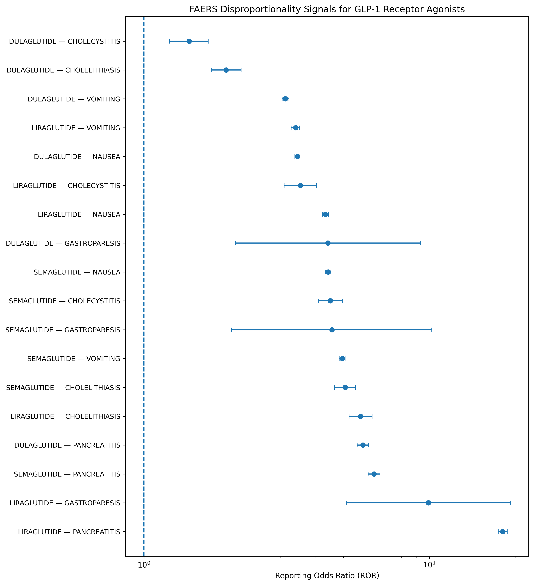

# GLP-1 Receptor Agonist Pharmacovigilance Using FDA FAERS

Status: v0.2 — initial disproportionality analysis complete

This project is a reproducible pharmacovigilance study exploring whether selected adverse events are disproportionately reported with commonly used GLP-1 receptor agonists in the FDA Adverse Event Reporting System (FAERS), accessed through the openFDA Drug Event API.

The project is designed as a learning and portfolio study in **pharmacoepidemiology, real-world safety evidence, and regulatory evidence generation**.

> **Important:** This is a spontaneous-report pharmacovigilance analysis. A reporting signal is **not** evidence that a drug causes an adverse event, and FAERS cannot be used to estimate incidence or absolute risk.

## Research question

Among FDA adverse-event reports, which pre-specified safety events are disproportionately reported with selected GLP-1 receptor agonists, and how consistent are those signals across drugs and over time?

## Drugs
- semaglutide
- liraglutide
- dulaglutide

## Pre-specified adverse events
- pancreatitis
- cholelithiasis
- cholecystitis
- gastroparesis
- nausea
- vomiting

## Planned analyses
1. Drug-level report counts and common reaction terms
2. Reporting Odds Ratio (ROR) with 95% CI for each Drug × Event pair
3. Serious-report and calendar-year sensitivity analyses
4. Conservative regulatory/RWE interpretation
   
## Initial Results

The initial disproportionality analysis identified elevated reporting odds ratios across all pre-specified drug–event pairs in the current FAERS query framework.

The strongest signal was observed for liraglutide and pancreatitis (ROR 18.08, 95% CI 17.44–18.75). Pancreatitis was also disproportionately reported with semaglutide (ROR 6.40, 95% CI 6.10–6.72) and dulaglutide (ROR 5.85, 95% CI 5.59–6.13).

For semaglutide, elevated reporting signals were also observed for cholelithiasis (ROR 5.07), vomiting (ROR 4.95), gastroparesis (ROR 4.56), cholecystitis (ROR 4.50), and nausea (ROR 4.42).

Gastroparesis produced relatively high ROR estimates for liraglutide (ROR 9.93) and dulaglutide (ROR 4.41), but these estimates were based on small numbers of matching reports and therefore had substantially wider confidence intervals.

These findings should be interpreted strictly as pharmacovigilance reporting signals. FAERS is a spontaneous reporting system and cannot establish incidence, absolute risk, or causal treatment effects.

### Forest plot

Figure 1. Reporting Odds Ratios (RORs) with 95% confidence intervals for pre-specified adverse events reported with semaglutide, liraglutide, and dulaglutide in FDA FAERS. The dashed vertical line represents the null value (ROR = 1). The x-axis is displayed on a logarithmic scale. Estimates represent reporting disproportionality and should not be interpreted as incidence, absolute risk, or causal effects.

## Why this project

This repository complements **ATLAS — ICU Early Deterioration Prediction** by adding a second methodological track focused on:
- pharmacoepidemiology
- drug safety
- real-world evidence
- regulatory interpretation
- observational-data limitations

The longer-term goal is to progress from pharmacovigilance signal detection toward comparative effectiveness and causal inference using longitudinal real-world data.

## Data source

FDA FAERS via the official openFDA Drug Event API.

Base endpoint: `https://api.fda.gov/drug/event.json`

### Data snapshot

Primary analysis accessed the openFDA Drug Event API on 5 October 2026.

Because FAERS/openFDA is updated over time, report counts and disproportionality estimates may change when the analysis is re-run at a later date.

## Current milestone

**v0.2**
- research question and analysis protocol defined
- exposures and outcomes pre-specified
- openFDA data retrieval implemented
- 18 drug–event combinations analysed
- Reporting Odds Ratios and 95% confidence intervals calculated
- forest plot generated
- initial pharmacovigilance interpretation completed

  **Next milestone**
- validate drug exposure and MedDRA event definitions
- perform serious-report sensitivity analysis
- examine calendar-year reporting patterns
- assess robustness of the broad FAERS comparator
- define the next longitudinal RWE step using EHR, claims, or registry data

## Tech stack
Python, pandas, requests, NumPy, scipy, matplotlib, Jupyter Notebook

## Author
**Majed Hamad, MD**

Medical doctor transitioning into clinical data science, pharmacoepidemiology, real-world evidence, and clinical AI.

GitHub: https://github.com/Majed-MD-AI
